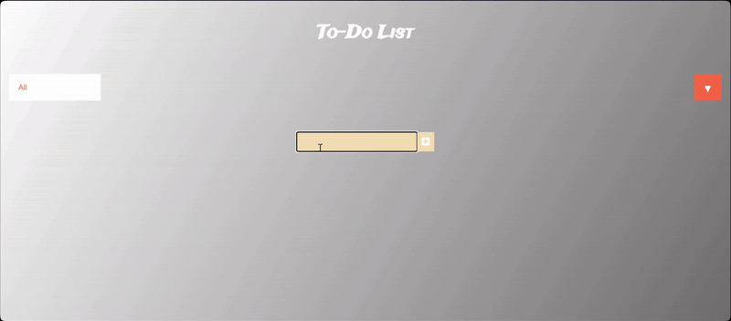

# Todo-List as Static Website

This app marked the beginning of my web development journey. I have created this app as a starting point in learning how the three main different components of any website work.

## Installation

1. Clone the repository.
2. Open the project in your preferred code editor.
3. Open `index.html` in your web browser.

# Demo

